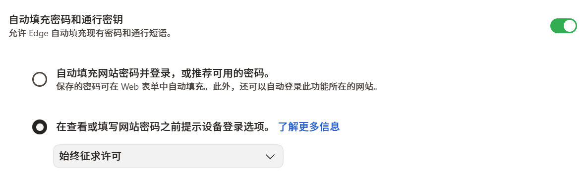
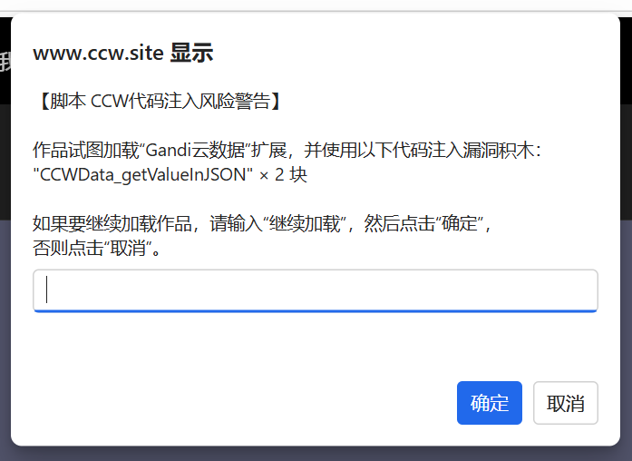
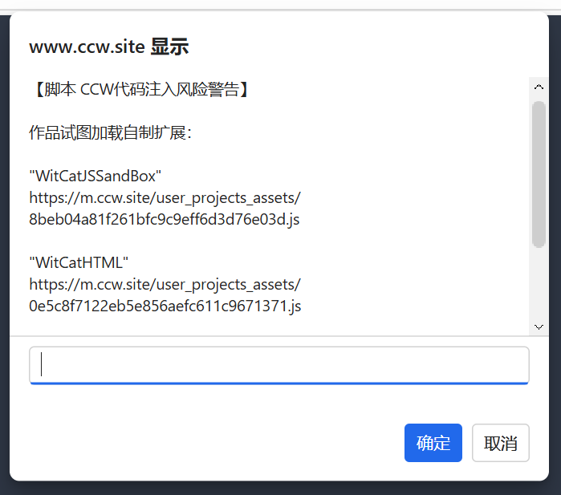
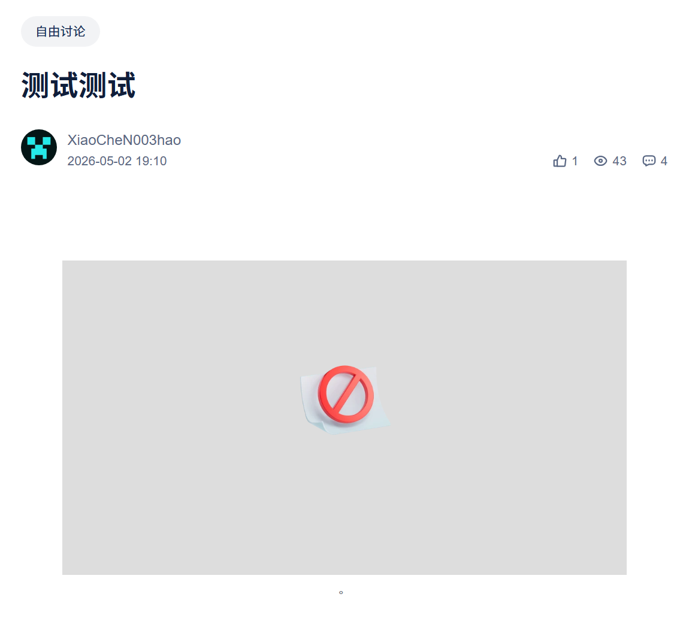

CCW代码注入风险警告，让你的账号更安全。  

安装TamperMonkey，然后点击下方链接，安装脚本：  
https://bddjr.github.io/CCW-Code-Injection-Risk-Warning/CCW-Code-Injection-Risk-Warning.user.js  

该脚本支持检测并拦截以下攻击：
- 基于作品加载第三方扩展的代码注入漏洞攻击
- 基于创作者学院的文章里嵌入 iframe 的代码注入漏洞攻击
- 个人资料的“学校”字段太长导致页面无响应（卡死）

> [!CAUTION]  
> 攻击者成功注入恶意代码之后，可以盗取浏览器自动填充的账号密码，即使网页未显示输入框。  
> 建议禁用浏览器的自动填充密码，或者改为 “在查看或填写网站密码之前提示设备登录选项。始终征求许可”  
> 
>   

> [!CAUTION]  
> 该脚本暂时不能检测或拦截基于 Scratch 编辑器编辑造型的代码注入攻击。  
> 参考 https://muffin.ink/blog/scratch-vulnerability-disclosure/  
> 漏洞演示 https://www.ccw.site/detail/69f73e772a7d36316189ef73  

> [!NOTE]
> 记录共创世界的前端代码注入漏洞、可能的盗号方式和防护方式建议。  
> https://github.com/bddjr/CCW-Code-Injection  

---

效果图：

